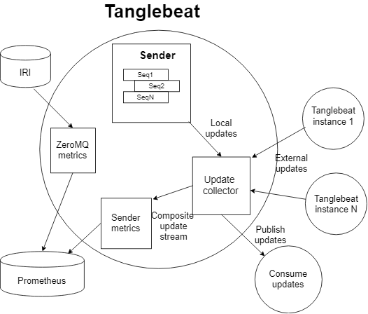

# [tanglebeat.com](http://tanglebeat.com)

### Table of contents
- [About Tanglebeat](#about_tanglebeat)
- [What it can be usefull for?](#what_it_can_be_useful_for)
- [Architecture](#architecture)
- [Contents of the repository](#contents_of_the_repository)
- [Download and install](#download_and_install)
- [Configure](#configure)
- [Run](#run)
- [Advanced configurations](#advanced_configurations)

## Summary
**Tanglebeat** is a configurable software agent with the primary purpose of 
collecting IOTA Tangle-related metrics to [Prometheus TSDB](https://prometheus.io/) 
later to be displayed with such tools as [Grafana](https://grafana.com). 

It can be run in various standalone and distributed configurations to ensure 
high availability and objectivity of the metrics. 

Tanglebeat is a result of experimenting with different approaches to how to measure a Tangle in 
objective and reliable way.

## What it can be useful for?
The functions of the Tanglebeat are:

##### A hub for IRI ZMQ streams
Tanglebeat  collects messages from many IRI ZMQ sources and produces 
one output message stream which represents operational state of the network as a whole 
(as opposed to the ZMQ stream from a specific node). 
Tangleabeat uses output stream to calculate metrics (see. below)

ZMQ sources can change on the fly while some nodes are going down or up, 
syncing or going out of sync, other nodes restarting and so on. 
Typically Tanglebeat is listening to 50 and more IRI nodes. Tanglebeat combines 
incoming data by using some kind of quorum based algorithm to produce healthy output stream: 
message is passed to the output only after been received from several different sources.

Applications which rely on IRI ZMQ data may want to use Tanglebeat as ZMQ source 
independent from any IRI node. Output message stream is exposed by using 
[Nanomsg](https://nanomsg.org/) as a transport, functionally equivalent to ZMQ. 

##### A collector of ZMQ-based metrics 
These are usual metrics like *TPS*, *CTPS*, *Conf.rate*, *duration between milestones*. 
Tanglebeat also collects from ZMQ value based metrics such as number of confirmed bundles, 
value of confirmed transactions/bundles and similar.

Tanglebeat submits all metrics to the [Prometheus](https://prometheus.io/) instance of your choice.
*Prometheus* is times series database intended for collections time series data 
(timed sequences of floating point numbers). *Prometheus* provides REST API and PromQL formula 
language to access stored time series data in every imaginable way.

Prometheus is often used as a data source for [Grafana](https://grafana.com), a tool to display 
metrics in user friendly way: charts, gauges and similar.

##### A collector of non-ZMQ metrics 
Some useful IOTA metrics can't be calculated from ZMQ data or it is more practical to collect it
in other way. These metrics are submitted to *Prometheus* as well.

Tanglebeat (a separate module _tbsender_) does active sending of funds in IOTA network and calculates transfer statistics: 
transfers per hour, average transfer time, interval of expected transfer time and others. 
It does it by sending and confirming/promoting few iotas worth transfers from one account to 
another in the endless loop, along addresses of the same seed. Several seeds (sequences are used). 

- *Transfers Per Hour* or TfPH metrics is calculated the following way:
    * *(number if confirmed transfers completed in last hour in all sequences* / 
    *(average number of active sequences in the last hour)*
    
    Average number of active sequences is used to adjust for possible downtimes 
   
- *Average transfer time* is calculated from transfer statistics.
- Transfer confirmation time is estimatad by taking 25 and 75 percentiles by real 
transfer confirmation in last hour.
- *Network latency*. Promotion transactions are sent to the network to promote transfers. 
Tanglebeat records time when sent transaction returns from one of ZMQ streams back

##### A ZMQ state monitor
Tanglebeat exposes endpoint which returns states of all input ZMQ streams together with
some data of each ZMQ stream. Thus many nodes can be monitored at once by up/down status, 
sync status, tps, ctps and conf. rate

## Architecture

_Tanglebeat_ consists of two programs: _Tanglebeat_ itself and _Tbsender_. 
The former can be run alone. _Tbsender_ is a separate program which does transfers
to calculate non-ZMQ metrics. It sends all necessary data to _Tanglebeat_ 
which submits metrics to _Prometheus_.

**Picture**

## Contents of the repository

Repository is structured as Go packages

- Directory `tanglebeat` contains Go package for the executable of main Tanglebeat program.
- Directory `tbsender` contains Go package for the executable of the Tbsender.
- Directory `examples\readnano` contains example how to read _Nanomsg_ data stream, 
an output of the _Tanglebeat_
- Directory `lib` contains common part. Some of it can be used as independent packages 
in other Go projects
    * `confirmer` contains library for promotion, reattachment and confirmation of any bundle.
    * `multiapi` contains library for IOTA API calls simultaneously to 
    several nodes with automatic handling of responses. Redundant API calling is handy to
    ensure robustness of the daemon programs by using several IOTA nodes at once.
   
 
## Download and install

##### Download and install Go
You will need Go compiler and environment to compile _Tanglebeat_ binaries on your
platform.

Follow the [instructions](https://golang.org/doc/install) how to install Go. 
Make sure to define `GOPATH` environment variable to the root where all your 
Go projects and/or dependencies will land. 
The `GOPATH` directory should contain at least `src` (for sources) and `bin` 
(for executable binaries) subdirectories. 
Set `PATH` to your `GOPATH/bin`

##### Download Tanglebeat

To download _tanglebeat_ package run:
 
`go get -d github.com/lunfardo314/tanglebeat/tanglebeat` 

To download _tbsender_ package run: 

`go get -d github.com/lunfardo314/tanglebeat/tbsender` 
 
To download _readnano_ package run: 

`go get -d github.com/lunfardo314/tanglebeat/examples/readnano` 
 
##### Compile Tanglebeat binaries
 
Make directory `GOPATH/src/github.com/lunfardo314/tanglebeat/tanglebeat` current.

Run `go install` 
 
Make directory `GOPATH/src/github.com/lunfardo314/tanglebeat/tbsender` current.

Run `go install` 

Make directory `GOPATH/src/github.com/lunfardo314/tanglebeat/examples/readnano` current.

Run `go install` 
 
The above will produce three executable binaries in `GOPATH/bin` directory
  
## Configure  
 
 
#-----------------------------

#### Picture

### Introduction

