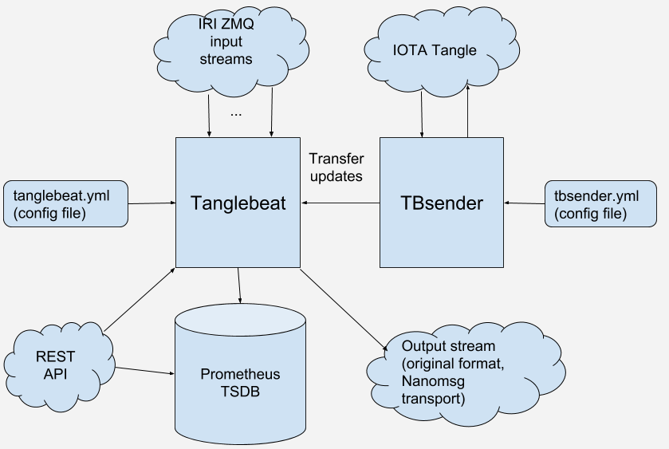

# Tanglebeat 

**Tanglebeat** is a configurable software agent with the primary purpose of 
collecting IOTA Tangle-related metrics to [Prometheus Time Series Database](https://prometheus.io/). 
Historical metrics data later can be retrieved and displayed 
with such tools as [Grafana](https://grafana.com) or directly with [Prometheus API](https://prometheus.io/docs/prometheus/latest/querying/api/). 

Tanglebeat can be run in various standalone and distributed configurations to ensure 
high availability and objectivity of the metrics. 

Tanglebeat is a result of experimenting with different approaches to how to measure a Tangle in 
objective and reliable way. 

It was originally developed as standalone project. The site with live metrics can be found at [tanglebeat.com](http://tanglebeat.com)

Currently Tanglebeat it is being developed under the umbrella of joined **UNIO Project** funded by 
*Ecosystem Development Fund of IOTA Foundation*.


### Contents
- [Functions](#functions) What can it be useful for?
- [Picture](#picture)
- [Contents of the repository](#repository)
- [Download and install](#download-and-install)
- [Configure and run](#configure-and-run) 
- [Output stream](#output-stream)
- [Metrics exposed to Prometheus](#metrics-exposed-to-prometheus)


## Functions

#### A hub for IRI ZMQ streams
Tanglebeat collects messages from several IRI ZMQ inputs (configurable) and produces 
one **output message stream**. 
The resulting  output represents operational state of the part of the network
represented by those inputs. Inputs can cover some small cluster of the network or even one node, 
for example belonging to one operator (or one Economic Cluster in the future). 
It can also be very wide thus representing network as a whole. 
For example [tanglebeat.com](http://tanglebeat.com) usually listens to up to 50 nodes.
 
Tanglebeat produces output from incoming data by using some kind of quorum based algorithm. 
In short: a message is passed to the output only after been received from several different 
ZMQ sources. Quorum parameter is usually 2 or 3 or more but can also be 1 
(in case of single input ZMQ stream)

Output stream is used to calculate metrics. This way metrics reflects the performance and health 
of the network from the point of view of the cluster being listened to. 

ZMQ sources can go down or up, nodes syncing or going out of sync, 
other nodes restarting and so on. By requiring evidences from several sources Tanglebeat filters 
out garbage messages which are not propagated by the network or the cluster of nodes.

Applications which rely on IRI ZMQ data may want to use Tanglebeat as ZMQ source 
independent from any specific IRI node. 

Output message stream is exposed for external consumption by other programs (configurable).
Find [here how to use it](#output-stream).
 
#### A collector of ZMQ-based metrics 
ZMQ-based metrics are usual metrics like *TPS* (transactions per second), *CTPS* (confirmed transactions per scond),
*Conf.rate* (confirmation rate), *duration between milestones*. 
Tanglebeat also collects value based metrics such as *number of confirmed transfers* and 
*value of confirmed transfers*.

Tanglebeat exposes all metrics to the [Prometheus](https://prometheus.io/) instance of your choice or 
even several of them.
*Prometheus* is times series database intended for collections of time series data 
(timed sequences of floating point numbers). It provides REST API and PromQL formula 
language to access stored time series data in every practically imaginable way.

Prometheus is often used as a data source for [Grafana](https://grafana.com), a tool to display 
metrics in user friendly way: charts, gauges and similar.

#### A collector of non-ZMQ metrics 
Some useful IOTA metrics can't be calculated from ZMQ data or it is more practical to collect it
in another way. These metrics are submitted to *Prometheus* as well.

A separate module of Tanglebeat called _TBSender_ does active sending of funds in IOTA ledger
 and calculates transfer statistics: 
*transfers per hour*, *average transfer time*, *interval of expected transfer time* and others. 

It does it by sending and confirming/promoting few iotas worth transfers from one account to 
another in the endless loop, along addresses of the same seed. 
Several seeds (sequences) are used for that in parallel. 

- *Transfers Per Hour* or `TfPH` metrics is calculated the following way:
    * *(number if confirmed transfers completed in last hour in all sequences*) / 
    *(average number of active sequences in the last hour)*
    
    Average number of active sequences is used to adjust for possible downtimes. 
   
- *Average transfer time* is calculated from transfer statistics.
- Transfer confirmation time is estimated by taking _25 and 75 percentiles_ of real 
transfer confirmations times in the last hour.
- *Network latency*. Promotion transactions are sent to the network to promote transfers. 
Tanglebeat records time when sent transaction returns from one of ZMQ streams back and after averaging collects it
as a metrics. 

#### A ZMQ state monitor
Tanglebeat exposes endpoint which returns states of all input ZMQ streams. 
Thus many nodes can be monitored at once: by up/down status, 
sync status, tps, ctps and conf. rate and other parameters. 

The data on input streams is exposed using `/api1/internal_stats/` endpoint

## Picture

_Tanglebeat_ consists of two programs: _tanglebeat_ itself and _tbsender_. 
The former can be run alone. _tbsender_ is a separate (optional) program which does transfers
to calculate non-ZMQ metrics. It sends all necessary data to _tanglebeat_ instance 
which in turn submits metrics to _Prometheus_.



## Repository

- Directory `tanglebeat` contains Go package for the executable of main _tanglebeat_ program.
- Directory `tbsender` contains Go package for the executable of the _tbsender_.
- Directory `examples/nano2zmq` contains code of `nano2zmq` program, see [Output stream](#output-stream) how to use it.
- Directory `examples/readnano` contains example how to read output of the _Tanglebeat_ in the form 
of _Nanomsg_ data stream.
- Directory `lib` contains shared packages. Some of them can be used as independent packages 
in other Go projects
    * `lib/confirmer` contains library for promotion, reattachment and confirmation of any bundle.
    * `lib/multiapi` contains library for IOTA API calls performed simultaneously to 
    several nodes with automatic handling of responses. Redundant API calling is handy to
    ensure robustness of the daemon programs by using several IOTA nodes at once.
   
 
## Download and install

#### Download and install Go
You will need Go compiler and environment to compile Tanglebeat binaries on your
platform. It is easier than it sounds.  
Tanglebeat (except `nano2zmq`) doesn't have binary dependencies on other packages, it is pure Go program.

To install Go follow the [instructions](https://golang.org/doc/install). 
 
Make sure to define `GOPATH` environment variable to the root where all your 
Go projects and/or dependencies will land. 

The `GOPATH` directory should contain at least `src` (for sources) and `bin` 
(for executable binaries) subdirectories. 

Set `PATH` to your `GOPATH/bin`

#### Download Tanglebeat

To download main _tanglebeat_ package with dependencies run:
 
`go get -d github.com/unioproject/tanglebeat/tanglebeat/tanglebeat` 

To download _tbsender_ package with dependencies run: 

`go get -d github.com/unioproject/tanglebeat/tbsender` 
 
To download _nano2zmq_ package run: 

`go get -d github.com/unioproject/tanglebeat/examples/nano2zmq` 
 
To download _readnano_ package run: 

`go get -d github.com/unioproject/tanglebeat/examples/readnano` 
 
#### Compile Tanglebeat binaries
 
Make directory `GOPATH/src/github.com/unioproject/tanglebeat/tanglebeat` current and run `go install` 
 
Make directory `GOPATH/src/github.com/unioproject/tanglebeat/tbsender` current and run `go install` 

Make directory `GOPATH/src/github.com/unioproject/tanglebeat/examples/nano2zmq` current and run `go install` (C dependencies!)
 
Make directory `GOPATH/src/github.com/unioproject/tanglebeat/examples/readnano` current and run `go install` 
 
The above will produce respective executable binaries in `GOPATH/bin` directory.
  
## Configure and run
 
##### Configure and run Tanglebeat instance
It is run with the command: `tanglebeat [-cfg <config file>]`

Tanglebeat instance is configured via YAML config file. It is expecting `tanglebeat.yml` 
in the current directory or in the directory specified by `SITE_DATA_DIR` 
environment variable.  
It also can be specified with `-cfg <config file>` command line flag.

Directory `examples/config` contains [example](examples/config/tanglebeat.yml) of the config file. 
Please read instructions right in the file. In most cases you'll only need to adjust ports used
by the instance and static list of URI's of IRI ZMQs you want your instance to listen to.

Another important part is `quorumToPass` parameter. It controls how many evidences from different sources is needed
to pass the message to the output. If you run tanglebeat with one input, it must be 1. Otherwise it must be 2 or more. 
For example if you set it to `5` each fifth message with the same hash will be pushed to the output
 while messages which, for some reason, are circulating among 4 nodes only will be filtered out.

##### Configure Prometheus
Note, that Prometheus is needed for Tanglebeat only if you want to store metrics. 
It is not needed if you use it only as a message hub. 

Any Prometheus instance can collect (scrape) metrics from Tanglebeat instance. 
You need to install one only if you don't have one yet. Otherwise you need: 
- to specify `scrape target` in the config file of the Prometheus instance.
- to provide `tanglebeat.rules` to the Prometheus (only if you run TBSender)

Follow instruction to download and [install Prometheus](https://prometheus.io/docs/prometheus/latest/installation/).

Metrics of the Tanglebeat will be exposed to Prometheus with endpoint `/metrics` on the port, configured in `tanglebeat.yml`:
```
webServerPort: 8082
``` 

Respective `scrape target` must be specified in the configuration file of the Prometheus.

Here we also provide [tanglebeat.rules](/examples/config/tanglebeat.rules) 
file which has to be specified for the Prometheus instance to calculate `tfph_adjusted` metrics if you want to use TBSender 
for TfPH metrics. See Prometheus docs.

If you want to display Prometheus metrics, you can install Grafana server by following 
[these instructions](https://grafana.com/docs/installation/). 


##### Configure TBSender
TBSender is run only if you need TfPH and network latency metrics. It is run by command `tbsender`.
TBSender is expecting configuration file `tbsender.yml` in the current directory or in the directory
specified by `SITE_DATA_DIR` environment variable.

Please find here an example of [tbsender.yml](https://github.com/unioproject/tanglebeat/blob/master/examples/config/tbsender.yml)

It contains detailed comments of how to set up configuration parameters. In general, you'll need to specify
following things to set up the environment of TBSender:

- Global parameters for sequences: URLs of IRI nodes, API timeouts and similar. 
- Specify sequences. Eeach sequence of addresses is defined by `seed` and `index0` parameters. 
Sequence of addresses is security level 2 addresses with the `seed` starting at specified index. 
TBSender will be sending iotas along those sequences: 
whole balance of the current address to the next address and so on in a loop.
    
    Each sequence can override global parameters if needed: nodes, promo strategy, timeouts etc.

## Output stream
Output can be enabled/disabled the following way: 
```
iriMsgStream:
    outputEnabled: true
    outputPort: 5500    
```

If enabled, output stream is exposed using [Nanomsg](https://nanomsg.org/) as a transport.
It is functionally equivalent to ZMQ and messages are [exactly the same format as received 
from IRI ZMQ](https://docs.iota.org/docs/iri/0.1/references/zmq-events).

The following types of IRI ZMQ messages are available from the output Nanomsg stream: 
- `tx` (transaction)
- `sn` (confirmation)
- `lmi` (latest milestone changed)
- `lmhs` (latest solid milestone hash). 

We are using Nanomsg as output for technical reasons (which may become irrelevant in the future).
Meanwhile, if you want to stick to ZMQ as as transport, we provide 
[Nanomsg to ZMQ converter](https://github.com/unioproject/tanglebeat/tree/dev/examples/nano2zmq).

After compiled (see above), it can be run by the command:

`nano2zmq [-from <input nanoimsg URI> [ -to <output ZMQ port> ] ]`

By default it reads Nanomsg input `tcp://tanglebeat.com:5550` and sends it to the port `5556` 
as ZMQ stream.  

For example `nanomsg -from tcp://localhost:5550` will read Nanomsg on 5550 and produce ZMQ output on 5556.

Note that `nano2zmq` uses [this Zero MQ library for Go](https://github.com/pebbe/zmq4) and so it has 
binary dependencies with original ZeroMQ version 4.0.1 which must be 
installed (Tanglebeat itself don't have this dependency).

## Metrics exposed to Prometheus

The following metrics are exposed to Prometheus by Tanglebeat. It can be found in Grafana admin frontend when designing
charts and panels.

- `tanglebeat_tx_counter_compound` counter of `tx` (transaction) messages. Used to calculate TPS metrics
- `tanglebeat_ctx_counter_compound` counter of `sn` (confirmation) messages. Used to calculate CTPS metrics and 
confirmation rate. 
- `tanglebeat_transfer_volume_counter_prod` - counter of transferred amount in iotas.

   It sums up approximately calculated volume of transfer. It is calculated by summing up values of positive 
   transactions in the bundle less transactions which do not move iotas in the bundle, i.e. those address 
   which net sum is 0 (fake transfers) and less assumed transfer to reminder address.
   The reminder is assumed equal to value of the last transaction in the bundle if it is positive and it does not
   belong to the fake transfer. Otherwise it is 0.
   
- `tanglebeat_transfer_counter_prod` counter of confimed bundles with positive moved volume of iotas.

- `tanglebeat_miota_price_usd` IOTA price as taken form *Coincap* site

- `tanglebeat_echo_first` time in miliseconds when first echo of the transaction, send by TBSender, 
is seen from ZMQ inout. 
- `tanglebeat_echo_last`  time in seconds when last echo of the transaction, send by TBSender, comes form all
ZMQ input. 

- `tanglebeat_lm_conf_rate_5min`, `tanglebeat_lm_conf_rate_10min`, 
`tanglebeat_lm_conf_rate_15min`,`tanglebeat_lm_conf_rate_30min` confirmation rate as provided by Luca Moser.
Is is based on statistics collected while sending zero value transactions and obeserving it's confirmation.

- `tanglebeat:confirmation_metrics:tfph_adjusted` **TfPH** or `Transfers Per Hour` metrics. 
Average number of confirmed transfer one sequence of TBSender was able to make in last 1 hour
